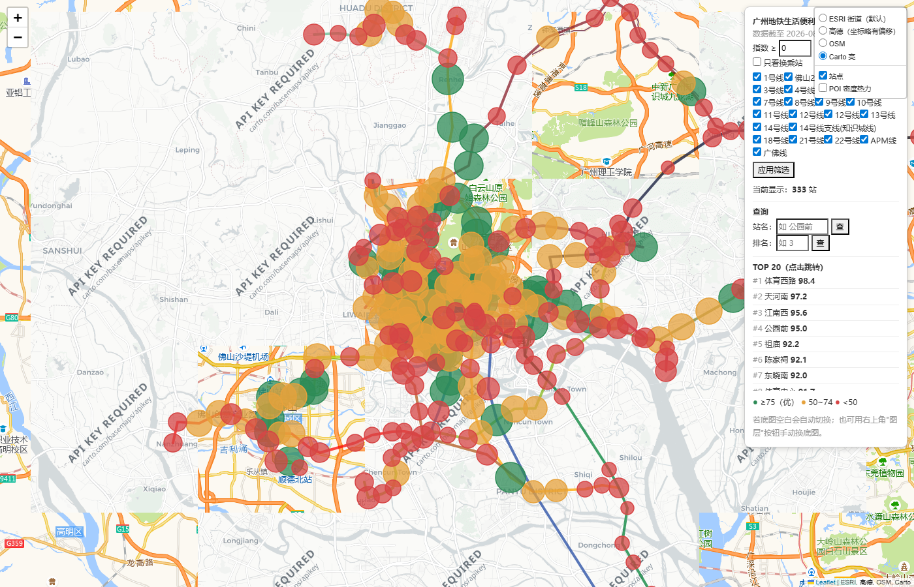

# 广州地铁生活便利度分析系统

一个用 **高德开放平台官方数据** 分析广州 333 个地铁站周边生活配套，并生成 **可交互地图** 的数据分析与可视化项目。

> 🗺️ **在线演示**：`metro_map.html`（自包含单文件，双击即可打开，无需服务器；也可部署到 GitHub Pages 获得在线链接）

## 效果展示



## 功能特性

- **数据采集**：333 个地铁站 × 7 类配套（餐饮 / 购物 / 生活服务 / 医疗卫生 / 科教文化 / 交通设施 / 大型商场），全部来自高德开放平台官方 API，带缓存与断点续跑
- **便利指数模型**：各类配套按全市百分位归一化后加权求和；购物项采用"数量 70% + 大型商场 30%"的复合评分，兼顾数量与质量
- **交互地图**：23 条线路可视化、站点按指数着色、POI 密度热力层、按线路/指数/换乘站筛选
- **查询功能**：按站名查询排名与详情、按排名反查站点、TOP20 榜单一键跳转；选中站点自动弹出信息
- **双底图坐标自适应**：Carto / OSM / ESRI 底图使用 WGS-84 坐标，高德底图自动切换为官方 GCJ-02 坐标（精确对齐，无偏移）
- **自包含单文件**：所有 JS / CSS / 数据内嵌进一个 HTML，离线可用，可分享

## 技术栈

| 模块 | 技术 |
|------|------|
| 数据采集 | 高德开放平台 Web 服务 API（POI 周边搜索 / 坐标转换）、OpenStreetMap |
| 数据处理 | Python、pandas、坐标转换（GCJ-02 ↔ WGS-84） |
| 空间分析 | 1000 米缓冲区统计、百分位归一化、加权指数模型 |
| 可视化 | folium + Leaflet、热力层、图层控制、自定义 JS 交互 |
| 自动化 | 定时刷新、缓存、断点续跑、Playwright 无头验证 |

## 便利指数模型

对每个站点：

```
指数 = 餐饮×25% + 购物×20% + 生活服务×20% + 交通设施×15% + 医疗卫生×10% + 科教文化×10%
购物评分 = 购物数量百分位×70% + 大型商场数百分位×30%
```

- 各类配套数量按**全市百分位**归一化（0~100），消除量纲差异
- **大型商场加权**：解决"批发市场数量多但不宜逛"的质量问题，让真商圈（体育西路、天河南）与批发集散地（华林寺、中大南门）正确区分

## 数据说明

- 数据截至 2026-08，来自高德开放平台官方 POI（半径 300 米统计）
- 字段：站点名 / 线路 / 经纬度 / 6 类配套数量 / 大型商场数 / 便利指数 / 全市排名
- 坐标为板块级近似 + 官方坐标转换，仅用于学习研究，请勿用于精确导航

## 运行

```bash
# 安装依赖
pip install -r requirements.txt

# 配置高德 key（可选，用于重新采集/生成）
# 在 secrets.json 中填写：{"AMAP_KEY": "你的高德key"}

# 一键生成地图
python run_all.py
```

生成结果输出到 `output/广州地铁生活便利地图.html`（或本仓库根目录的 `metro_map.html`）。

## 目录结构

```
├── metro_map.html        # 成品交互地图（自包含单文件）
├── screenshot.png        # 效果截图
├── run_all.py            # 一键生成入口
├── config.json           # 可调参数（权重/半径/底图等）
├── requirements.txt
├── src/
│   ├── stations.py       # 地铁站点/线路数据（高德公开接口）
│   ├── amap_poi.py       # 高德 POI 采集（含 600 封顶处理、商场加权数据）
│   ├── gcj_convert.py    # 官方坐标转换（WGS-84 → GCJ-02）
│   ├── index.py          # 便利指数计算
│   ├── build_map.py      # 交互地图生成（含查询/高亮/双底图切换）
│   ├── osm_poi.py        # OSM 数据解析（备用数据源）
│   └── summary.py        # 排名摘要
└── data/
    ├── stations.json     # 站点与线路
    ├── poi_stats.json    # 每站配套数量
    ├── index.json        # 便利指数与排名（最终分析结果）
    └── ...
```

## 免责声明

- 本项目仅用于个人学习与研究，数据版权归高德地图/OpenStreetMap 所有
- 便利指数为基于公开数据的启发式评分，不代表官方观点
- `secrets.json`（高德 API Key）**不随仓库公开**，请自行配置
